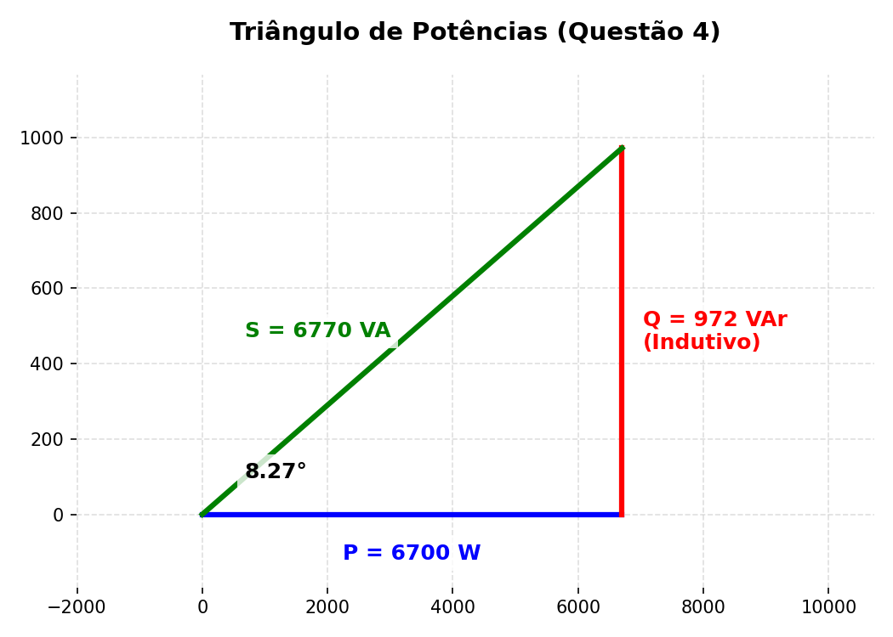

# Prova 2 — Questão 4
**Capítulo 11 | Tema: Cargas em Paralelo e Triângulo de Potências**

> **Enunciado (05 pontos):**
> Uma fonte de $240\text{ V}$ alimenta as seguintes cargas:
>
> | Carga 1 | Carga 2 |
> |---------|---------|
> | $P = 5500\text{ W}$ | $P = 1200\text{ W}$ |
> | $Q = 850\text{ VAr}$ (capacitivo) | $FP = 0,55$ (indutivo) |
>
> **Determine:**
> a) A potência aparente total.
> b) O fator de potência da carga total.
> *(O desenho do Triângulo também foi exigido).*

---

## 🎂 Resolução Passo a Passo (Receita de Bolo)

### Passo 1: Desmontar cada máquina
O objetivo inicial é isolar o $P$ e o $Q$ de cada carga, prestando muita atenção na "Regra de Ouro" dos sinais.

**Carga 1:** (Valores dados diretamente)
- **$P_1 = 5500\text{ W}$**
- **$Q_1 = -850\text{ VAr}$** 
  *(CUIDADO: É **capacitivo**, então a regra diz que o sinal deve ser negativo!)*

**Carga 2:** (Falta descobrir o Q)
- **$P_2 = 1200\text{ W}$**
- O Fator de Potência é $0,55$. Vamos achar o ângulo exato do triângulo dessa máquina: $\theta_2 = \arccos(0,55) \approx 56,633^\circ$.
- Para achar o $Q_2$, usamos a fórmula da tangente: $Q_2 = P_2 \cdot \tan(\theta_2)$.
  $$ Q_2 = 1200 \cdot \tan(56,633^\circ) \approx \mathbf{1822,18\text{ VAr}} $$
  *(É **indutivo**, então o sinal se mantém positivo!)*

> [!TIP]
> **Na Casio fx-991LA CW:** 
> Você pode fazer essa conta de uma vez sem perder precisão nos decimais: `1200 × tan(acos(0.55))` e apertar `EXE`. Resultado direto e exato: $1822,18\text{ VAr}$.

### Passo 2: O Liquidificador (Somar Ativa com Ativa, Reativa com Reativa)
- **Ativa Total:** $P_{total} = P_1 + P_2 = 5500 + 1200 = \mathbf{6700\text{ W}}$
- **Reativa Total:** $Q_{total} = Q_1 + Q_2 = -850 + 1822,18 = \mathbf{+972,18\text{ VAr}}$
  *(Como o $Q_{total}$ deu positivo, já sabemos que a indústria inteira se comporta de forma **Indutiva**).*

### Passo 3: O Gran Finale na Casio
A Potência Complexa Total ($S_{total}$) em formato Retangular é **$6700 + j972,18$**.

> [!TIP]
> **A Mágica da Casio:**
> 1. Vá no aplicativo **Complexo**.
> 2. Digite: `6700 + 972.18i`.
> 3. Aperte `FORMAT` $\to$ `Polar Coord`. 
> 4. Ela vai mostrar: **$6770,14 \angle 8,26^\circ$**.

- **Resposta da Letra A (Potência Aparente Total):**
  É o módulo do resultado da calculadora: $\mathbf{S_{total} = 6770\text{ VA}}$.
- **Resposta da Letra B (Fator de Potência Total):**
  É o cosseno do ângulo da calculadora: $FP_{total} = \cos(8,26^\circ) = \mathbf{0,989}$ **(Indutivo)**.

### Passo 4: Como desenhar o Triângulo
Siga as regras de desenho da Folha de Cola:
1. **O Chão:** Desenhe $P = 6700$ para a direita.
2. **A Parede:** Como o $Q_{total}$ é $+972$ (positivo), desenhe a linha para CIMA.
3. **O Telhado:** Feche a hipotenusa ($S = 6770$).
4. **O Ângulo:** Escreva $8,26^\circ$ na origem.

