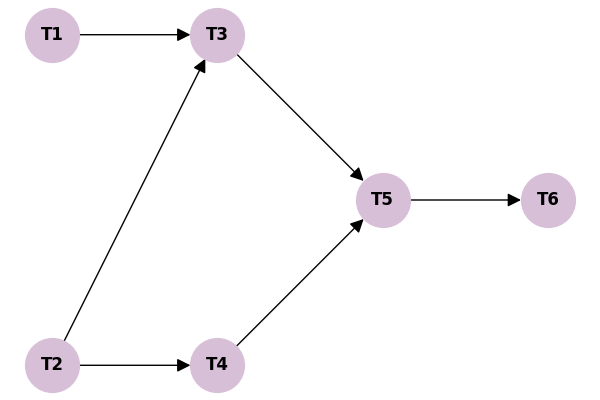
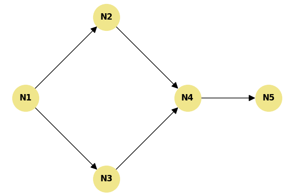

# Exercícios Extras de Fixação (Padrão de Prova)

Criei dois exercícios totalmente novos simulando o formato exato que a sua lista cobra. Eles vão exigir que você construa as tabelas do zero para treinar para a prova. Tente resolver em um papel antes de conferir o gabarito detalhado!

---

## Questão 1: Algoritmo de Kahn

Considere o seguinte diagrama de dependências de tarefas de um projeto:

**Sua Missão:**
a. Calcule os Graus de Entrada Iniciais. Qual(is) nó(s) inicia(m) na Fila do algoritmo de Kahn?
b. Execute o algoritmo de Kahn iterativamente. Use ordem numérica/alfabética em caso de empate na Fila. Exiba a tabela de rastreio com a Ordem Topológica gerada.

---

## Questão 2: Ordenação Topológica via DFS

Considere a seguinte rede de propagação de pacotes de dados:

**Sua Missão:**
a. Rastreie uma DFS começando pelo vértice **N1**. Use os estados (Branco, Cinza, Preto) ou monte a tabela da pilha de recursão. Desempate sempre pela ordem numérica menor (ex: entre N2 e N3, vá para N2).
b. Registre os tempos de finalização e extraia a ordenação topológica final baseada na regra de ouro da DFS.

---
          

## Gabaritos (Receitas de Bolo)

### Gabarito Questão 1 (Kahn)

**a. Graus Iniciais e Fila**
- T1: 0, T2: 0, T3: 2, T4: 1, T5: 2, T6: 1.
- Fila Inicial $Q$: `[T1, T2]`.

**b. Tabela de Rastreio (Kahn)**

| Fase | Nó Retirado | Graus Reduzidos | Nova Fila $Q$ | Ordem $L$ |
|---|---|---|---|---|
| 1 | **T1** | Grau de T3 cai para 1. | `[T2]` | `[T1]` |
| 2 | **T2** | Grau de T3 cai para 0, T4 cai para 0. | `[T3, T4]` | `[T1, T2]` |
| 3 | **T3** | Grau de T5 cai para 1. | `[T4]` | `[T1, T2, T3]` |
| 4 | **T4** | Grau de T5 cai para 0. | `[T5]` | `[T1, T2, T3, T4]` |
| 5 | **T5** | Grau de T6 cai para 0. | `[T6]` | `[T1, T2, T3, T4, T5]` |
| 6 | **T6** | - | `[]` | `[T1, T2, T3, T4, T5, T6]` |

*Ordenação Topológica Válida:* T1 $\rightarrow$ T2 $\rightarrow$ T3 $\rightarrow$ T4 $\rightarrow$ T5 $\rightarrow$ T6.

---

### Gabarito Questão 2 (DFS)

**a. Rastreio da DFS e Tempos**

| Tempo | Ação (Pilha de Recursão) | Nó | Estado do Nó |
|---|---|---|---|
| 1 | Descoberta a partir do inicio. | N1 | N1 muda para Cinza |
| 2 | N1 visita N2 (desempate). | N2 | N2 muda para Cinza |
| 3 | N2 visita N4. | N4 | N4 muda para Cinza |
| 4 | N4 visita N5. | N5 | N5 muda para Cinza |
| 5 | N5 não tem vizinhos. **Finaliza**. | N5 | N5 muda para **Preto (F=5)** |
| 6 | Volta para N4. Sem mais vizinhos. **Finaliza**. | N4 | N4 muda para **Preto (F=6)** |
| 7 | Volta para N2. Sem mais vizinhos. **Finaliza**. | N2 | N2 muda para **Preto (F=7)** |
| 8 | Volta para N1. N1 visita N3. | N3 | N3 muda para Cinza |
| 9 | N3 tenta visitar N4 (já está Preto). Pula. Sem mais vizinhos. **Finaliza**. | N3 | N3 muda para **Preto (F=9)** |
| 10 | Volta para N1. Sem mais vizinhos. **Finaliza**. | N1 | N1 muda para **Preto (F=10)** |

**b. Tempos de Finalização e Ordem Topológica**

- N1: 10
- N3: 9
- N2: 7
- N4: 6
- N5: 5

*Ordenação Topológica (Decrescente de F):* **N1 $\rightarrow$ N3 $\rightarrow$ N2 $\rightarrow$ N4 $\rightarrow$ N5**.
