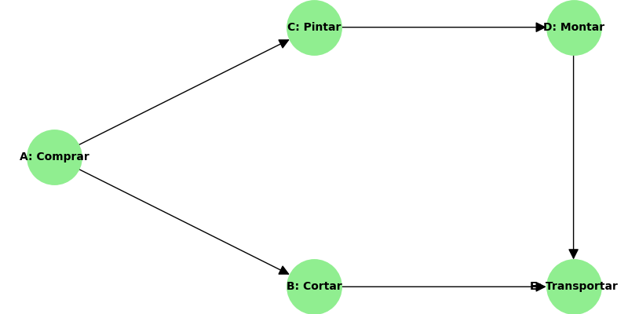

# Exercício Proposto: Algoritmo de Kahn

Chegou a sua vez de praticar! O segredo é organizar a tabela e prestar muita atenção quando um grau cair para zero.

## O Desafio

Considere o grafo que representa as dependências para construir uma pequena estante de madeira:

> [!IMPORTANT]
> Utilize a ordem alfabética para desempate caso dois ou mais nós entrem na fila com grau zero ao mesmo tempo.

**Sua missão:**
1. Determine os graus de entrada iniciais de todos os nós (A, B, C, D, E).
2. Defina a Fila inicial.
3. Aplique o Algoritmo de Kahn até a fila esvaziar, informando passo a passo quem sai, quais graus caem, e a ordem final.

*Tente resolver num papel antes de olhar a resposta abaixo!*

---
        

## Gabarito

**Passo 1: Graus Iniciais**
- A: 0
- B: 1 (vem de A)
- C: 1 (vem de A)
- D: 1 (vem de C)
- E: 2 (vem de B e D)

Fila $Q$: `[A]`

**Tabela de Rastreio:**

| Fase | Nó Retirado | Graus Reduzidos | Nova Fila $Q$ | Ordem Final $L$ |
|---|---|---|---|---|
| 1 | A | B cai pra 0, C cai pra 0 | `[B, C]` (desempate alfa) | `[A]` |
| 2 | B | E cai pra 1 | `[C]` | `[A, B]` |
| 3 | C | D cai pra 0 | `[D]` | `[A, B, C]` |
| 4 | D | E cai pra 0 | `[E]` | `[A, B, C, D]` |
| 5 | E | - | `[]` | `[A, B, C, D, E]` |

A ordenação válida gerada foi: **A $\rightarrow$ B $\rightarrow$ C $\rightarrow$ D $\rightarrow$ E**.
