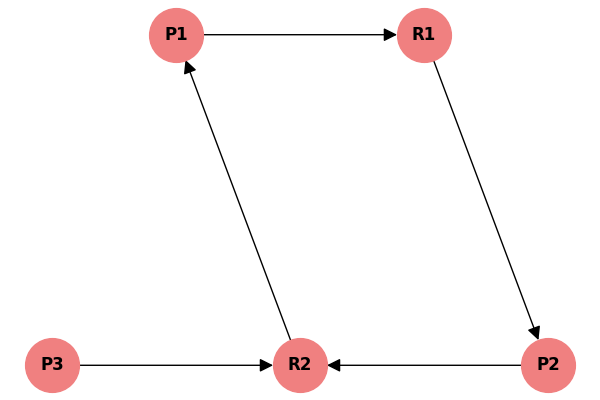

# Receita de Bolo: Ordenação Topológica (Kahn e Detecção de Ciclos)

Neste arquivo, vamos resolver dois exercícios **exatamente iguais aos da sua lista de exercícios** (Seções 2.3 e 2.4). O primeiro mostra uma execução perfeita do Algoritmo de Kahn, e o segundo mostra o que acontece quando o grafo é "bagunçado" e tem um ciclo (Deadlock).

---

## Exemplo 1: Kahn Perfeito (Lista 2.3)

Este grafo representa pré-requisitos normais.

> [!NOTE]
> Regra de desempate: Quando houver mais de um nó com grau 0, escolha o de **menor número**.

### Passo 1: Graus de Entrada Iniciais
Conte quantas setas apontam para cada nó:
* 1: 0 
* 2: 0
* 3: 0
* 4: 2 (vindo de 1 e 2)
* 5: 2 (vindo de 2 e 3)
* 6: 2 (vindo de 4 e 5)

**Fila Inicial $Q$:** `[1, 2, 3]` (nós com grau 0).
**Lista Final $L$:** `[]`.

### Passo 2: Executar as Fases (Rodadas)

| Fase | Nó Retirado | Graus Reduzidos | Nova Fila $Q$ | Ordem Final $L$ |
|---|---|---|---|---|
| 1 | **1** | Grau do 4 cai para 1. | `[2, 3]` | `[1]` |
| 2 | **2** | Grau do 4 cai para 0. Grau do 5 cai para 1. | `[3, 4]` | `[1, 2]` |
| 3 | **3** | Grau do 5 cai para 0. | `[4, 5]` | `[1, 2, 3]` |
| 4 | **4** | Grau do 6 cai para 1. | `[5]` | `[1, 2, 3, 4]` |
| 5 | **5** | Grau do 6 cai para 0. | `[6]` | `[1, 2, 3, 4, 5]` |
| 6 | **6** | Nenhum. | `[]` | `[1, 2, 3, 4, 5, 6]` |

A **Ordenação Topológica** final e perfeita foi: `1 -> 2 -> 3 -> 4 -> 5 -> 6`.

---

## Exemplo 2: Falha por Deadlock / Ciclo (Lista 2.4)

Agora veja este grafo modelando alocação de recursos em um Sistema Operacional. Ele está mais "bagunçado".

### Passo 1: Graus de Entrada Iniciais
* P1: 1 (vem de R2)
* R1: 1 (vem de P1)
* P2: 1 (vem de R1)
* R2: 2 (vem de P2 e P3)
* P3: 0 (nenhuma seta chega nele)

O único nó com grau 0 é o **P3**.
**Fila Inicial $Q$:** `[P3]`.

### Passo 2: Tentando rodar o algoritmo

**Fase 1:**
- **Nó Retirado:** `P3`
- **Lista Final $L$:** `[P3]`
- **Vizinhos afetados:** O nó `P3` aponta para `R2`. O grau de `R2` cai de 2 para 1.
- **ALERTA:** Nenhum nó novo atingiu grau 0! 
- **Fila $Q$ atual:** `[]` (Ficou vazia).

### Conclusão: Como identificar o Ciclo?
A fila $Q$ esvaziou na Fase 1, mas a nossa Lista Final só tem 1 elemento (falta P1, R1, P2 e R2). 

O algoritmo **trava (aborta)**. Isso é a identificação matemática de um **Ciclo (Deadlock)**. Se você olhar o desenho, os nós `{P1, R1, P2, R2}` formam um ciclo fechado onde cada um depende do outro infinitamente. É impossível ordená-los topologicamente.
