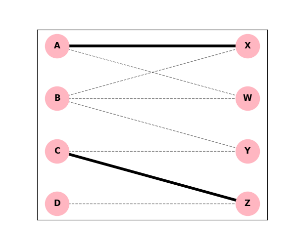

# Receita de Bolo: Caminhos Aumentantes (Grafo Bipartido)

Vamos ver na prática como aumentar um emparelhamento usando **Caminhos Aumentantes** e a **Diferença Simétrica**. 

## O Problema

Temos um grafo bipartido (Grupo A de um lado, Grupo B do outro).
O Emparelhamento atual $M$ tem as arestas em **negrito**: $M = \{(A, X), (C, Z)\}$.

*(No diagrama acima, os pares fortes são A-X e C-Z).*

## Passo a Passo

### Passo 1: Identificar os Vértices Livres
Vértices que NÃO participam do emparelhamento $M$.
- **No Grupo Esquerdo:** B, D
- **No Grupo Direito:** W, Y

### Passo 2: Buscar um Caminho Aumentante
Comece em qualquer vértice livre (ex: **C** ... ops, **C** não é livre! Comece em **B**).
O caminho deve alternar: `Livre -> (aresta Fora) -> (aresta Dentro) -> (aresta Fora) -> Livre`.

Vamos tentar a partir de **B**:
1. B é livre. Procuramos uma aresta FORA de $M$. Vamos para **Y**. 
   Caminho: `B -> Y (Fora)`
2. Mas Y é livre! Paramos aqui.
   Temos um caminho aumentante trivial: `B -> Y`.

Vamos tentar outro caminho mais complexo a partir de **C**? Não, caminhos aumentantes precisam partir de nós livres!
Vamos tentar a partir de **B** de novo, mas indo para outro lado:
1. `B -> W (Fora)`. W é livre. Outro caminho aumentante!

E se tentarmos de **D**?
1. `D -> Z (Fora)`. Z não é livre.
2. De Z, a única aresta DENTRO de $M$ é `Z -> C`.
   Caminho até aqui: `D -> Z (Fora) -> C (Dentro)`
3. De C, pegamos uma aresta FORA. Vamos para `Y`.
   Caminho: `D -> Z (Fora) -> C (Dentro) -> Y (Fora)`
4. **Y é livre!** Encontramos um caminho aumentante de tamanho 3.

Vamos usar esse caminho longo para praticar: **D $\rightarrow$ Z $\rightarrow$ C $\rightarrow$ Y**.

### Passo 3: Diferença Simétrica
Vamos trocar o que está "Dentro" pelo que está "Fora" no caminho que escolhemos.

**Caminho:** D (Fora) Z (Dentro) C (Fora) Y

- **Remover de $M$ (o que era "Dentro"):** $(C, Z)$
- **Adicionar a $M$ (o que era "Fora"):** $(D, Z)$ e $(C, Y)$

### Passo 4: Novo Emparelhamento
O antigo $M$ era: $\{(A, X), (C, Z)\}$.
Remova $(C, Z)$ e coloque os novos:

**Novo $M'$ = $\{(A, X), (D, Z), (C, Y)\}$**

O emparelhamento que antes tinha 2 arestas, agora tem 3! Ele cresceu!
