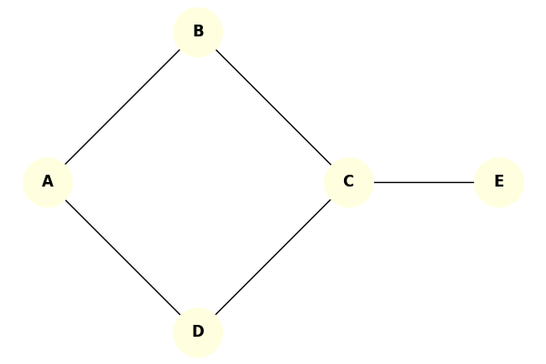

# Receita de Bolo: Algoritmo de Welsh-Powell

Vamos colorir os vértices do grafo abaixo passo a passo usando o método guloso de Welsh-Powell.

## Grafo de Exemplo

*Regra de desempate:* Se os graus forem iguais, use a ordem alfabética.

---

## Passo a Passo

### Passo 1: Calcular os Graus
Conte quantas arestas saem de cada nó:
* A: 2
* B: 2
* C: 3
* D: 2
* E: 1

### Passo 2: Ordenar (Grau Decrescente)
Ordem: C(3), A(2), B(2), D(2), E(1).
*(Nota: Com o desempate alfabético entre A, B e D, a ordem final é **C, A, B, D, E**).*

### Passo 3: Tabela de Coloração (Rodadas)

Vamos montar a tabela descendo a fila (C, A, B, D, E) e tentando pintar todo mundo com a primeira cor livre. Se der conflito, pulamos.

| Vértice | Grau | Ação / Avaliação | Cor Atribuída |
|---|---|---|---|
| **C** | 3 | Primeiro não colorido. | **Cor 1** |
| **A** | 2 | Adjacente a C? Não. Recebe Cor 1. | **Cor 1** |
| **B** | 2 | Adjacente a C (Cor 1)? Sim. Pula. | - |
| **D** | 2 | Adjacente a C e A (Cor 1)? Sim. Pula. | - |
| **E** | 1 | Adjacente a C (Cor 1)? Sim. Pula. | - |

*Saldo da Rodada 1: C e A com Cor 1.*
*(Nova rodada para os não coloridos: B, D, E)*

| Vértice | Grau | Ação / Avaliação | Cor Atribuída |
|---|---|---|---|
| **B** | 2 | Primeiro não colorido. | **Cor 2** |
| **D** | 2 | Adjacente a B (Cor 2)? Não. Recebe Cor 2. | **Cor 2** |
| **E** | 1 | Adjacente a B ou D (Cor 2)? Não. Recebe Cor 2. | **Cor 2** |

*Saldo da Rodada 2: B, D e E com Cor 2.*

### Passo 4: Fim
Todo mundo tem cor. Quantas cores usamos no total? Apenas **2 cores**.
Portanto, para este grafo, o número cromático $\chi(G)$ é no máximo 2. Como não é possível colorir com apenas 1 cor (tem arestas), sabemos que o número exato é 2. Isso também prova que este grafo é **bipartido**!
