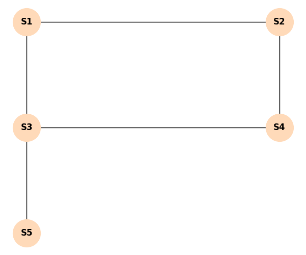

# Exercício Proposto: Otimização de Roteadores (Conjunto Dominante)

Treine sua intuição heurística e gulosa!

## O Desafio

Você foi contratado para colocar sinal de Wi-Fi num prédio. O prédio tem salas conectadas por corredores (arestas). Se você coloca o roteador numa sala, ela e todas as salas vizinhas diretas ganham internet.

Queremos achar um **Conjunto Dominante Mínimo** (gastar o mínimo de dinheiro com roteadores).

> [!IMPORTANT]
> Use a heurística gulosa: Sempre coloque o roteador na sala que alcança o **maior número de salas que AINDA NÃO têm internet** (contando com a própria sala do roteador). Em caso de empate de quem cobre mais, escolha a sala de **menor número**.

**Sua Missão:**
1. Verifique qual sala dá internet para mais gente no início (qual nó tem o maior grau, lembrando de contar a si próprio). Aloque o primeiro roteador.
2. Anote quais salas ganharam internet.
3. Se sobrou alguém sem internet, olhe quem pode dar internet para essa pessoa de forma mais eficiente agora (maior cobertura de "desconectados").
4. Liste o Conjunto Dominante final e quantos roteadores foram necessários.

*Tente resolver antes de ler a resposta abaixo!*

---
        

## Gabarito

**Passo 1: Primeira Iteração**
- Potencial do S1: Cobre S1, S2, S3. (Cobre 3)
- Potencial do S2: Cobre S2, S1, S4. (Cobre 3)
- **Potencial do S3:** Cobre S3, S1, S4, S5. **(Cobre 4)** - O Vencedor!
- Potencial do S4: Cobre S4, S2, S3. (Cobre 3)
- Potencial do S5: Cobre S5, S3. (Cobre 2)

Alocamos o 1º Roteador em **S3**.

**Passo 2: Quem tem internet agora?**
Salas com internet: {S1, S3, S4, S5}.
Sala sem internet: {S2}.

**Passo 3: Segunda Iteração**
Só S2 precisa de internet.
Quem pode dar internet para S2 (e que ainda agregue o maior número de desconectados - que no caso é só 1)?
O roteador pode ser colocado em S1, S2, ou S4 (todos alcançam o S2).
Seguindo a regra de desempate de menor número, escolhemos a sala **S1**. (Ou poderíamos ter escolhido colocar no próprio S2).

Alocamos o 2º Roteador em **S1**.
*(Nota: O roteador em S1 é super redundante, já que S3 já cobria todo mundo da esquerda, mas ele resolveu o problema do S2)*.

**Passo 4: Resultado Final**
Conjunto Dominante gerado: **{S1, S3}**.
Número de roteadores usados: 2.

*Reflexão extra:* Se tivéssemos colocado os roteadores em S2 e S3? Também funcionaria. A heurística nos dá uma solução excelente rapidamente, mesmo que hajam alternativas equivalentes.
