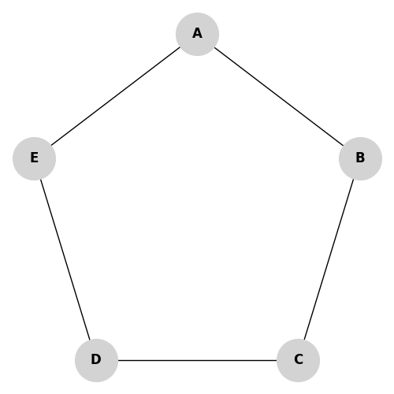

# Receita de Bolo: Teorema de Gallai

Vamos resolver um problema prático unindo os conceitos de Cobertura de Vértices e Conjunto Independente.

## O Grafo

Considere o seguinte grafo em formato de anel (um pentágono):

Total de Vértices: $|V| = 5$.

## O Problema
1. Encontrar o Conjunto Independente Máximo ($IS_{max}$).
2. Usar o Teorema de Gallai para deduzir a Cobertura de Vértices Mínima ($VC_{min}$).

---

## Passo a Passo

### Passo 1: Encontrar o Conjunto Independente Máximo
A regra é: Escolher o maior número de vértices de modo que **nenhum deles seja ligado a outro escolhido**.

1. Escolhemos o vértice **A**. (Nós no Conjunto: `{A}`)
2. Os vértices B e E são proibidos agora (são vizinhos de A).
3. Sobram C e D. Escolhemos o **C**. (Nós no Conjunto: `{A, C}`)
4. O vértice D é vizinho de C (e vizinho livre de E). Se escolhermos D, ele briga com o C. O E também não pode entrar porque briga com o A.

Acabaram os vértices.
O nosso conjunto é **$\{A, C\}$**. O tamanho é 2.
$\alpha(G) = |IS_{max}| = 2$.
*(Nota: $\{B, D\}$ ou $\{A, D\}$ também seriam opções corretas de tamanho 2).*

### Passo 2: Usar o Teorema de Gallai
O teorema nos diz:
$|IS_{max}| + |VC_{min}| = |V|$

Nós já sabemos que:
- $|IS_{max}| = 2$ (A e C).
- $|V| = 5$ (Total de nós).

Logo:
$2 + |VC_{min}| = 5$
$|VC_{min}| = 3$.

Sabemos que o tamanho da Cobertura de Vértices Mínima é **3**.

### Passo 3: Identificar a Cobertura
O Teorema de Gallai nos diz não apenas o tamanho, mas **QUAIS** são os vértices.
A Cobertura de Vértices é exatamente o **complemento** (o que sobrou) do Conjunto Independente.

- Todos os Vértices: $\{A, B, C, D, E\}$
- Conjunto Independente: $\{A, C\}$
- **O que sobrou:** $\{B, D, E\}$

Portanto, a Cobertura de Vértices Mínima é $VC_{min} = \{B, D, E\}$.

**Verificando se está certo:** Se os guardas estão em B, D e E, será que vigiamos todas as ruas?
- Rua (A, B) -> coberta pelo B.
- Rua (B, C) -> coberta pelo B.
- Rua (C, D) -> coberta pelo D.
- Rua (D, E) -> coberta pelo D (e pelo E).
- Rua (E, A) -> coberta pelo E.
Todas as 5 arestas vigiadas. Sucesso!
