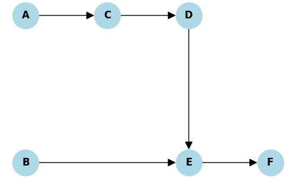
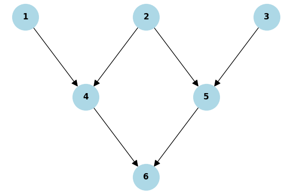
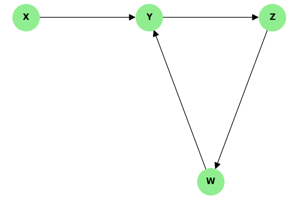
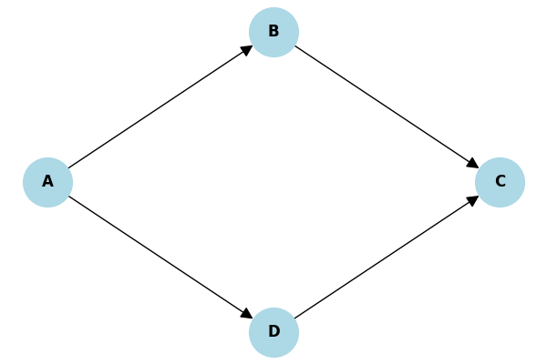

# Resoluções da Lista: Ordenação Topológica

Compilação de todas as resoluções das práticas da lista relativas ao tema 1.

---

## 2.2 Exemplo Passo a Passo: Kahn em um DAG

**Enunciado:** Considere o DAG com vértices `{A, B, C, D, E, F}` e arestas: `A -> C, C -> D, B -> E, D -> E, E -> F`. Monte a tabela inicial de graus de entrada e execute Kahn.

**Graus Iniciais:** A:0, B:0, C:1, D:1, E:2, F:1.
Como A e B possuem grau 0, iniciam na fila.

**Tabela de Rastreio (Kahn):**

| Fase | Nó Retirado | Graus Reduzidos | Nova Fila $Q$ | Ordem $L$ |
|---|---|---|---|---|
| 0 | - | - | `[A, B]` | `[]` |
| 1 | **A** | C cai para 0 (entra na fila) | `[B, C]` | `[A]` |
| 2 | **B** | E cai para 1 | `[C]` | `[A, B]` |
| 3 | **C** | D cai para 0 (entra na fila) | `[D]` | `[A, B, C]` |
| 4 | **D** | E cai para 0 (entra na fila) | `[E]` | `[A, B, C, D]` |
| 5 | **E** | F cai para 0 (entra na fila) | `[F]` | `[A, B, C, D, E]` |
| 6 | **F** | - | `[]` | `[A, B, C, D, E, F]` |

*Ordenação produzida:* **A $\rightarrow$ B $\rightarrow$ C $\rightarrow$ D $\rightarrow$ E $\rightarrow$ F**.

---

## 2.3 Prática de Fixação: Kahn (Resolvido à mão)

**Enunciado:** (Ver Grafo no material com nós 1 a 6). Execute Kahn iterativamente com desempate numérico menor.

**Graus iniciais:** 1:0, 2:0, 3:0, 4:2, 5:2, 6:2. Fila Inicial: `[1, 2, 3]`.

| Fase | Nó | Graus Reduzidos | Fila $Q$ | Ordem $L$ |
|---|---|---|---|---|
| 0 | - | - | `[1, 2, 3]` | `[]` |
| 1 | **1** | Grau do 4 cai para 1. | `[2, 3]` | `[1]` |
| 2 | **2** | Grau do 4 cai para 0. Grau do 5 cai para 1. | `[3, 4]` | `[1, 2]` |
| 3 | **3** | Grau do 5 cai para 0. | `[4, 5]` | `[1, 2, 3]` |
| 4 | **4** | Grau do 6 cai para 1. | `[5]` | `[1, 2, 3, 4]` |
| 5 | **5** | Grau do 6 cai para 0. | `[6]` | `[1, 2, 3, 4, 5]` |
| 6 | **6** | - | `[]` | `[1, 2, 3, 4, 5, 6]` |

---

## 2.4 Prática Kahn: Falha por Deadlock (Detecção de Ciclo)

**Enunciado:** Considere grafo de alocação OS (P1, R1, P2, R2, P3).

**a. Graus Iniciais:** P1:1, R1:1, P2:1, R2:2, P3:0. O único nó com grau 0 é o P3, logo a Fila inicia com `[P3]`.

**b. Tabela de Rastreio (Kahn):**

| Fase | Nó Retirado | Graus Reduzidos | Nova Fila $Q$ | Ordem $L$ |
|---|---|---|---|---|
| 0 | - | - | `[P3]` | `[]` |
| 1 | **P3** | R2 cai para 1. Nenhum nó novo atingiu grau 0. | `[]` | `[P3]` |

Na Fase 1, a fila Q ficou vazia, mas a lista topológica só tem 1 elemento (falta P1, R1, P2, R2). O algoritmo **trava (aborta)**, sinalizando **Ciclo (Deadlock)** nos nós restantes.

---

## 3.2 Prática DFS: Back-Edge em Grafo com Ciclo

**Enunciado:** Considere grafo com ciclo X -> Y -> Z -> W -> Y. Rastreie DFS começando do X.

| Tempo | Ação (Pilha de Recursão) | Nó Atual | Estado do Nó |
|---|---|---|---|
| 1 | Descoberta a partir do main | X | X muda para Cinza |
| 2 | X visita Y | Y | Y muda para Cinza |
| 3 | Y visita Z | Z | Z muda para Cinza |
| 4 | Z visita W | W | W muda para Cinza |
| 5 | W tenta visitar Y. | Y | **Conflito! Y já é Cinza.** |

No tempo 5, W tenta visitar Y que já é "Cinza" (ativo na pilha). A aresta W $\rightarrow$ Y é uma **Back-Edge**, provando ciclo.

---

## 3.3 Exemplo: DFS para Ordenação Topológica

**Enunciado:** DAG `{A, B, C, D, E, F}` com arestas A->C, C->D, B->E, D->E, E->F. Iniciar ordem alfabética.

| Tempo | Ação (Pilha de Recursão) | Nó | D/F |
|---|---|---|---|
| 1 | Descoberta a partir de main | A | D(A)=1 |
| 2 | A visita C | C | D(C)=2 |
| 3 | C visita D | D | D(D)=3 |
| 4 | D visita E | E | D(E)=4 |
| 5 | E visita F | F | D(F)=5 |
| 6 | F não tem vizinhos. Finaliza. | F | **F(F)=6** |
| 7 | Volta para E. Sem mais vizinhos. | E | **F(E)=7** |
| 8 | Volta para D. Finaliza. | D | **F(D)=8** |
| 9 | Volta para C. Finaliza. | C | **F(C)=9** |
| 10| Volta para A. Finaliza. | A | **F(A)=10**|
| 11| main chama prox. não visitado: B | B | D(B)=11|
| 12| B aponta para E (já visitado). Finaliza. | B | **F(B)=12**|

*Ordem (Decrescente de F):* **B $\rightarrow$ A $\rightarrow$ C $\rightarrow$ D $\rightarrow$ E $\rightarrow$ F**.

---

## 3.4 Prática de Fixação: DFS (Resolvido à mão)

**Enunciado:** DAG A->B, A->D, B->C, D->C. Comece pelo A, ordem alfabética para desempate.

| Tempo | Ação (Pilha de Recursão) | Nó | D/F |
|---|---|---|---|
| 1 | Descoberta a partir de main | A | D(A)=1 |
| 2 | A visita B (alfabética) | B | D(B)=2 |
| 3 | B visita C | C | D(C)=3 |
| 4 | C não tem vizinhos. Finaliza. | C | **F(C)=4** |
| 5 | Volta para B. Sem vizinhos. Finaliza. | B | **F(B)=5** |
| 6 | Volta para A. A visita D. | D | D(D)=6 |
| 7 | D aponta para C (já visitado). Finaliza. | D | **F(D)=7** |
| 8 | Volta para A. Finaliza. | A | **F(A)=8** |

*Tempos Finais:* A(8), D(7), B(5), C(4).
*Ordenação (Decrescente):* **A $\rightarrow$ D $\rightarrow$ B $\rightarrow$ C**.
