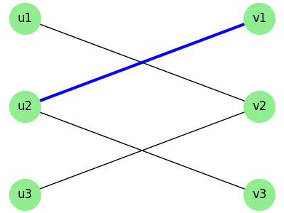
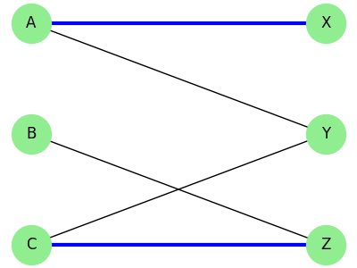
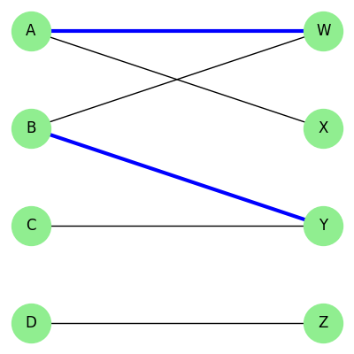
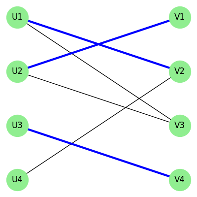

# Resoluções da Lista: Emparelhamento Máximo

Compilação de todas as resoluções das práticas da lista relativas ao tema 2.

---

## 5.2 Prática: Caminhos Aumentantes em Grafo Bipartido

**Enunciado:** Considere o grafo bipartido $G = (U \cup V, E)$, com $M = \{(u_2, v_1)\}$.

**a. O que é um caminho alternante e um caminho aumentante?**
- **Caminho alternante:** Caminho cujas arestas alternam entre pertencer a $M$ e não pertencer a $M$.
- **Caminho aumentante:** É um caminho alternante que começa e termina em vértices **livres** (não cobertos por $M$).

**b. M é maximal? Vértices livres:**
$M$ não é maximal, pois podemos adicionar $(u_3, v_3)$ sem conflito.
Vértices livres em $U$: $\{u_1, u_3\}$. Em $V$: $\{v_2, v_3\}$.

**c. Caminho aumentante partindo de $u_1$:**

| Sequência do Caminho | Status da Aresta |
|---|---|
| $u_1 \rightarrow v_1$ | Fora de $M$ (Nova) |
| $v_1 \rightarrow u_2$ | Dentro de $M$ (Existente) |
| $u_2 \rightarrow v_3$ | Fora de $M$ (Nova) |

Como $v_3$ também é livre, temos um caminho aumentante válido.
**Diferença Simétrica ($M \oplus P$):**
- Removemos: $(u_2, v_1)$
- Adicionamos: $(u_1, v_1)$ e $(u_2, v_3)$
*Novo emparelhamento:* $M' = \{(u_1, v_1), (u_2, v_3)\}$.

**d. É um casamento perfeito?**
Ainda não. $u_3$ e $v_2$ continuam livres e existe aresta entre eles. Caminho aumentante trivial: $u_3 \rightarrow v_2$.
*Resultado final:* $M'' = \{(u_1, v_1), (u_2, v_3), (u_3, v_2)\}$. Como cobre todos os 6 vértices, atingimos um casamento perfeito.

---

## 5.3 Prática Hopcroft-Karp 1 (Aumento Simples)

**Enunciado:** $M = \{(A, X), (C, Z)\}$. Encontre vértices livres e um caminho aumentante.

**a. Vértices Livres:**
- $B$ e $Y$.

**b. Caminho Aumentante:**
Começa em $B$ e termina em $Y$.
Sequência: $B \rightarrow Z$ (Fora), $Z \rightarrow C$ (Dentro), $C \rightarrow Y$ (Fora).

**c. Diferença Simétrica:**
- Arestas Removidas: $(C, Z)$.
- Arestas Adicionadas: $(B, Z)$ e $(C, Y)$.
*Novo $M'$:* $\{(A, X), (B, Z), (C, Y)\}$.

---

## 5.4 Prática Hopcroft-Karp 2 (Múltiplos Caminhos)

**Enunciado:** $M = \{(A, W), (B, Y)\}$.

**a. Vértices livres e Maximalidade:**
Livres: $\{C, D\}$ e $\{X, Z\}$. O emparelhamento não é maximal, pois $D$ e $Z$ possuem aresta direta entre eles.

**b. Caminho Aumentante partindo de C:**
Sequência: $C \rightarrow Y$ (Fora), $Y \rightarrow B$ (Dentro), $B \rightarrow W$ (Fora), $W \rightarrow A$ (Dentro), $A \rightarrow X$ (Fora).
*Diferença Simétrica:* Removemos $(B, Y)$ e $(A, W)$. Inserimos $(C, Y), (B, W), (A, X)$.
*Novo $M_1$:* $\{(C, Y), (B, W), (A, X)\}$.

**c. Caminho aumentante final:**
Restam livres $D$ e $Z$. Caminho aumentante é a aresta direta $D \rightarrow Z$.
*Final $M_{final}$:* $\{(C, Y), (B, W), (A, X), (D, Z)\}$.

---

## 5.5 Prática Hopcroft-Karp 3 (Grafo Denso)

**Enunciado:** $M = \{(U_1, V_2), (U_2, V_1), (U_3, V_4)\}$.

**a. Vértices Livres e ligação direta:**
Livres: $U_4$ e $V_3$. A ligação direta $U_4 \rightarrow V_3$ **não é válida** pois não existe essa aresta no grafo original. O caminho precisa trafegar por arestas existentes.

**b. Caminho aumentante de $U_4$:**
$U_4 \rightarrow V_2$ (Fora) $\rightarrow U_1$ (Dentro) $\rightarrow V_1$ (Fora) $\rightarrow U_2$ (Dentro) $\rightarrow V_3$ (Fora).

**c. Novo Emparelhamento:**
Remove: $(U_1, V_2), (U_2, V_1)$.
Insere: $(U_4, V_2), (U_1, V_1), (U_2, V_3)$. Aresta $(U_3, V_4)$ fica intacta.
*Final $M'$:* $\{(U_4, V_2), (U_1, V_1), (U_2, V_3), (U_3, V_4)\}$.
