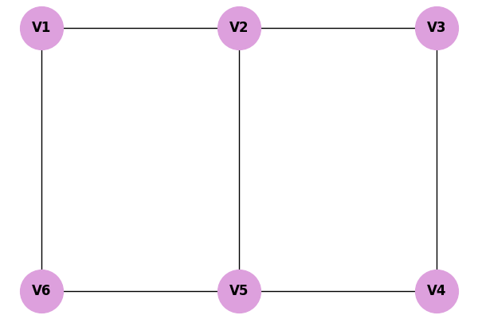
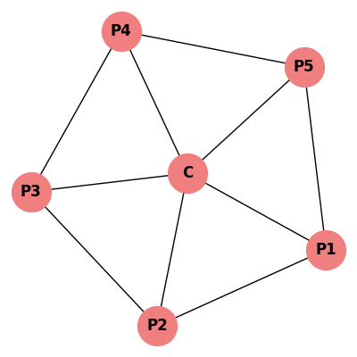

# Resoluções da Lista: Coloração de Grafos

Compilação de todas as resoluções das práticas da lista relativas ao tema 3.

---

## 10.2 Prática: Algoritmo de Welsh-Powell

**Enunciado:** Aplique o algoritmo guloso de Welsh-Powell no grafo (B, C, D, A, E).

**Passo 1 e 2: Graus e Ordenação**
Graus: B(3), C(3), D(3), A(2), E(1). 
Ordem (Decrescente com desempate alfabético): B, C, D, A, E.

**Passo 3: Tabelas de Coloração**

*Rodada da Cor 1:*

| Vértice | Grau | Avaliação (Conflitos) | Cor Atribuída |
|---|---|---|---|
| **B** | 3 | Primeiro sem cor. | **Cor 1** |
| **C** | 3 | Adjacente a B (Cor 1). Pula. | - |
| **D** | 3 | Adjacente a B (Cor 1). Pula. | - |
| **A** | 2 | Adjacente a B (Cor 1). Pula. | - |
| **E** | 1 | Não adjacente a B. Recebe Cor 1. | **Cor 1** |

*(Nota: como E só é adjacente a C, ele pode receber a Cor 1)*

*Rodada da Cor 2:*

| Vértice | Grau | Avaliação (Conflitos) | Cor Atribuída |
|---|---|---|---|
| **C** | 3 | Primeiro sem cor. | **Cor 2** |
| **D** | 3 | Adjacente a C (Cor 2). Pula. | - |
| **A** | 2 | Não adjacente a C. Recebe Cor 2. | **Cor 2** |

*Rodada da Cor 3:*

| Vértice | Grau | Avaliação (Conflitos) | Cor Atribuída |
|---|---|---|---|
| **D** | 3 | Primeiro sem cor. | **Cor 3** |

**Conclusão:** 
O algoritmo precisou de 3 cores. Como o grafo contém um triângulo completo entre B, C e D (clique máxima = 3), o número mínimo é 3. Logo, $\chi(G) = 3$.

---

## 10.3 Prática de Fixação: Welsh-Powell (6 Vértices)

**Enunciado:** Aplique Welsh-Powell no grafo V1-V6.

**Graus:** V1(2), V2(3), V3(3), V4(2), V5(3), V6(3).
**Ordem (Decrescente + Alfabética):** V2, V3, V5, V6, V1, V4.

*Rodada da Cor 1:*

| Vértice | Grau | Avaliação (Conflitos) | Cor Atribuída |
|---|---|---|---|
| **V2** | 3 | Primeiro não colorido. | **Cor 1** |
| **V3** | 3 | Adjacente a V2 (Cor 1). | - |
| **V5** | 3 | Não adjacente a V2. | **Cor 1** |
| **V6** | 3 | Adjacente a V2 e V5. | - |
| **V1** | 2 | Adjacente a V2. | - |
| **V4** | 2 | Adjacente a V5. | - |

*Rodada da Cor 2:*

| Vértice | Grau | Avaliação (Conflitos) | Cor Atribuída |
|---|---|---|---|
| **V3** | 3 | Primeiro não colorido. | **Cor 2** |
| **V6** | 3 | Não adjacente a V3. | **Cor 2** |
| **V1** | 2 | Adjacente a V6 (Cor 2). | - |
| **V4** | 2 | Adjacente a V3 (Cor 2). | - |

*Rodada da Cor 3:*

| Vértice | Grau | Avaliação (Conflitos) | Cor Atribuída |
|---|---|---|---|
| **V1** | 2 | Primeiro não colorido. | **Cor 3** |
| **V4** | 2 | Não adjacente a V1. | **Cor 3** |

**Conclusão:** $\chi(G) = 3$.

---

## 10.4 Prática de Fixação: Welsh-Powell (Grafo Estrela)

**Enunciado:** Roda W6 (C no centro e P1 a P5 na periferia formando um pentágono).

**Graus:** C(5), P1(3), P2(3), P3(3), P4(3), P5(3).
**Ordem:** C, P1, P2, P3, P4, P5.

*Rodada da Cor 1:*
- C recebe Cor 1. Todos os outros (P1 a P5) são adjacentes a C. Pula todos.

*Rodada da Cor 2:*
- P1 recebe Cor 2. P2 é vizinho, pula. P3 não é vizinho, recebe Cor 2. P4 é vizinho de P3, pula. P5 é vizinho de P1, pula. (Cor 2: P1, P3).

*Rodada da Cor 3:*
- P2 recebe Cor 3. P4 não é vizinho, recebe Cor 3. P5 é adjacente a P4, pula. (Cor 3: P2, P4).

*Rodada da Cor 4:*
- P5 recebe Cor 4.

**Conclusão:** O nó central C fica isolado com a Cor 1. Foram necessárias **4 cores** no total. $\chi(W_6) = 4$.
