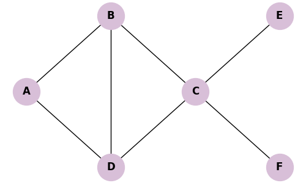
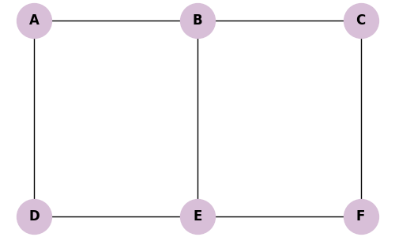
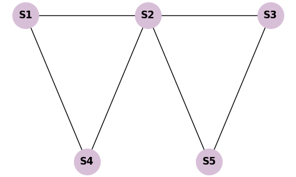
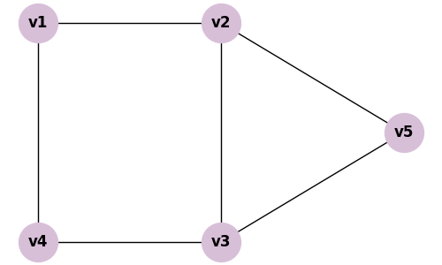

# Resoluções da Lista: Independência, Dominância e Cobertura

Compilação de todas as resoluções das práticas da lista relativas ao tema 5.

---

## 12.1 Prática: Algoritmo Guloso para Cobertura de Vértices

**Enunciado:** Execute a Aproximação Gulosa (escolhendo iterativamente a aresta, adicionando ambos nós à cobertura e removendo incidentes). Comece por (C, B).

**Tabela de Rastreio:**

| Passo | Aresta Escolhida | Vértices na Cobertura $K$ | Arestas Removidas |
|---|---|---|---|
| 1 | $(C, B)$ | **C, B** | $(C,B), (A,B), (D,B), (C,D), (C,E), (C,F)$ |
| 2 | $(A, D)$ | **A, D** | $(A,D)$ (era a única sobrevivente) |

O conjunto final gerado pela heurística é $K = \{B, C, A, D\}$.

---

## 12.2 Prática de Fixação: Teorema de Gallai em Grades

**Enunciado:** Grafo em formato de grade 3x2.

**a. Conjunto Independente Máximo ($IS_{max}$):**
Escolhemos alternadamente: A, C e E (nenhum deles tem aresta com outro do grupo). $IS_{max} = \{A, C, E\}$. Tamanho = 3.

**b. Cobertura de Vértices Mínima ($VC_{min}$):**
Teorema de Gallai: $|IS| + |VC| = |V|$.
Se $|V| = 6$ e $|IS| = 3$, então $VC_{min}$ é formada pelo complementar: $\{B, D, F\}$.

---

## 12.3 Prática de Fixação: Conjunto Dominante (Roteadores Wi-Fi)

**Enunciado:** Instalar o número mínimo de roteadores. 

**a. Independente Maximal é sempre Dominante?**
Sim, mas nem todo Conjunto Independente é dominante. Ex: $\{S1, S3\}$ é independente mas não domina S5.

**b. Conjunto Dominante Mínimo:**
Colocando um roteador em **S2**, ele domina a si mesmo e ilumina S1, S3, S4 e S5 de uma só vez. Apenas **1 roteador** no nó S2 é o Dominante Mínimo.

---

## 12.4 Prática de Fixação: Algoritmo Guloso para Conjunto Dominante

**Enunciado:** Escolha iterativamente o vértice que cobre o maior número de vértices não cobertos. Desempate alfabético.

**Iteração 1:**
- Coberturas possíveis: A(2), B(4), C(2), D(2), E(4), F(2). 
- Maior é 4 (B e E). Desempate: **B**.
- Vértices cobertos: $\{A, B, C, E\}$.
- Restam: $\{D, F\}$.

**Iteração 2:**
- Recalcula sobre os que restam: D cobre D (1 nó). E cobre D e F (2 nós). F cobre F (1 nó).
- Maior é **E**.
- Vértices cobertos: todos.

**Conjunto Dominante final:** $D = \{B, E\}$. É ótimo.

---

## 12.5 Prática: Identificação de IS e VC

**Enunciado:** Grafo da Seção 12.5.

**a. $VC_{min}$:**
Priorizamos altos graus. Escolhendo $v_2$ e $v_3$, cobrimos quase todas as arestas. Falta $(v_1, v_4)$. Escolhemos $v_1$. 
$VC_{min} = \{v_1, v_2, v_3\}$.

**b. $IS_{max}$:**
É o complemento de $VC_{min}$: $IS_{max} = \{v_4, v_5\}$.

**c. Teorema de Gallai:**
$2 + 3 = 5$ (Total de vértices é 5). Equação provada estruturalmente.
